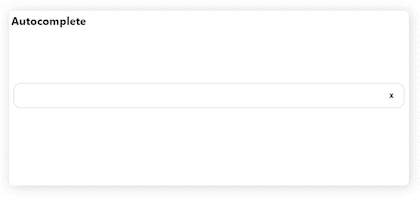
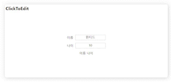
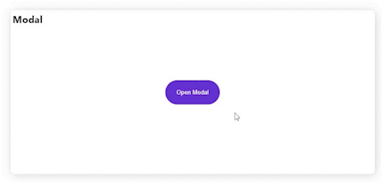
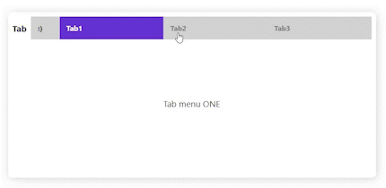
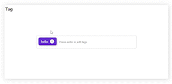
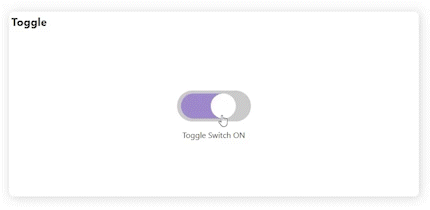

# 원티드 프리온보딩 프론트엔드 코스 선발 과제
```
npm i && npm start
```

***

## 기술 스택
- React - Create React App
- styled-components

***

1. 구현한 방법과 이유에 대한 간략한 내용
   - AutoComplete
     - 임의의 검색어가 담긴 배열(keywordArr)과 검색어 input 상태(searchInput)와 검색된 결과가 담긴 배열(searchResult)을 만들어서 검색어 state가 변경될 때마다 배열에 있는지 include method로 확인 후 result에 담아서 화면에 표시한다. input에 값을 입력할 때마다 검사해야 하니 useEffect deps에 input state를 넣어서 만들었었는데 리액트는 state가 바뀔 때마다 다시 렌더링 되니 useState만 사용하였다.
   - ClickToEdit
     - 더블 클릭이 됐을 때 edit 상태를 true로 바꾸어 조건부 렌더링으로 div -> input tag로 바꾸고 값을 수정하게 만들고 input 바깥을 클릭하면 onBlur 상태에서 수정 중인 상태를 flase로, 화면의 값을 바꾸는 역할을 하는 handleBlur 함수를 실행한다. 
   - Modal
     - 모달이 열렸는 지를 확인하는 isModalOpen state를 만들어서 모달 버튼을 클릭하면 상태를 true로 바꾸고 모달이 화면에 보이고 밑의 상태 메시지를 ON으로 표시하고, 모달 창의 x버튼을 누르면 상태를 false로 바꾸어 모달창을 안 보이게 하고 OFF로 표시했다. 모달은 다른 요소와 안 겹치고 위에 떠있어야 하므로 css의 absolute와 z-index, opacity 속성을 이용했다. 
   - Tab
     - 세 개의 탭이 있고 탭이 바뀔 때마다 문자가 달라져야 하므로 일단 기본 상태가 첫 번째 탭이 클릭된 상태고 메시지가 ONE이라 tab state를 만들어 default value를 'ONE'으로 설정하고, 두 번째 탭이 클릭되면 상태를 'TWO'로 바꾸는 방식으로 만들고, 선택된 탭의 배경색을 바꾸는 것은 styled-components props로 현재의 탭이 각각 ONE, TWO, THREE인지 체크하는 boolean 값을 넘겨서 조건에 해당하면 바꿨다.
   - Tag
    - 예시를 보니 리액트를 연습할 때 많이 만들었던 투두리스트가 떠올랐다. tag input, tagList state를 만들어서 input에 값을 입력하고 enter를 누르면 event.preventDefault()로 새로고침을 막고 input value가 빈문자열이 아니면 tagList에 id는 고유한 값을 만들기 위해 Date.now(), text는 tagInput value 이루어진 객체를 추가한다.
   - Toggle
     - 토글이 on인지 off인지 확인하는 state와 type이 checkbox인 input tag를 만들어서 check하면 onToggle state를 off로 해제하면 on으로 바꿔서 css의 :checked 선택자로 스타일을 구현했다.

***

1. 구현하면서 어려웠던 점과 해결 방법
   - AutoComplete
     - 문자열을 포함하는지 확인하는 자바스크립트의 api가 딱 떠오르지 않아서 indexOf를 썼었는데 includes가 더 명확한 것 같고 조금 더 최신 문법이라 사용했고, 더 나은 방법이 있을까 찾다 datalist라는 html tag를 발견했는데 리액트로 구현하는 것에 중점을 뒀다.
   - ClickToEdit
     - 바깥을 클릭하는 부분이 mouse 이벤트인지 focusout인지 헷갈려서 구글링 하다 onBlur를 발견해서 적용했다. 그리고 요구사항이 정확하게 적혀있지 않아서 처음에 input으로만 만들었다 더블클릭했을 때 input으로 바뀌게 만드는 부분이 조금 복잡했고 edit state를 만들어서 해결했다.   
   - Modal
     - 조건부렌더링으로 모달이 표시되니 transition이 적용되지 않아서 모달을 처음부터 css로 안 보이게 만들어서 자연스럽게 나타나게 했고, css로 만들지 않는 다른 방법이 있을까 고민하다 react portal을 찾았다. 그치만 이 예제의 경우 모달 컴포넌트 내에서만 띄우는 거라 css로 하는 게 적합하다고 생각했다. 
   - Tab
     - 크게 어려운 점은 없었고, 반복되는 부분을 ['ONE', 'TWO', 'THREE'] 배열로 만들어 map을 돌렸다.
   - Tag
     - input이 focus 되었을 때 감싸는 container border 색이 바뀌는데 그 부분 스타일을 어떻게 해야할지 이것저것 적용하느라 시간이 걸려서 구글링하다 css의 :focus-within 선택자를 발견해서 적용했다.
   - Toggle
     - 구현보다 토글버튼 스타일링이 조금 힘들었는데 이것도 구글링으로 해결했다.. 

***

1. 자세한 실행 방법
   - AutoComplete
     - 
   - ClickToEdit
     - 
   - Modal
     - 
   - Tab
     - 
   - Tag
     - 
   - Toggle
     - 
